# The Flywheel — Preference Data as a Side Effect of Use

*Companion to `spec-generative-interface.md`. Why the generative desktop is a data moat, and what to log from day one.*

## The insight

A generative desktop produces **gesture-level preference data over generated UI as a side effect of normal use**. Nobody has this dataset. Chat products get thumbs-up/down at conversation granularity; we get a labeled signal *per interaction, per surface region, per version*:

- every **scrub-back** in version history = negative label on the last change
- every **pin / freeze** = strong positive on the whole surface
- every **melt + immediate edit** = mild negative (it wasn't done)
- every **fork-choice** = a clean pairwise preference (chosen vs. discarded variant — RLHF gold)
- every **ghost-grab** = positive on a speculation; every ignored ghost = negative
- every **scribble-to-repair** = localized negative with a repair transcript attached
- every **desire path** (repeated use of an affordance) = positive weight on that affordance
- every **decay-unpinned surface** = weak negative (nothing worth keeping)

Users never fill out a survey. The interface *is* the labeling instrument.

```mermaid
flowchart TD
    A["USE<br/>people work in the shell"] --> B["GESTURES<br/>pin · scrub · fork · scribble<br/>grab · ignore · repeat"]
    B --> C["PREFERENCE TUPLES<br/>(intent, context, surface, action,<br/>loop, signal, outcome)"]
    C --> D["CURATION<br/>dedupe, decontaminate,<br/>eval-set carve-out"]
    D --> E["FINE-TUNES<br/>3–8B local model for the<br/>MORPH loop (latency, not quality)"]
    E --> F["FASTER LOOPS<br/>morph &lt;1s · better speculation ·<br/>smarter annealing"]
    F --> A
    style E fill:#1a3a2a,stroke:#2a6a4a
```



## The tuple schema

Log every interaction as:

```
{
  intent:        what was asked (or inferred),
  context:       space, companion, active surfaces, relationship depth,
  surface:       DSL/HTML at time of action + version id,
  action:        gesture or command issued,
  loop:          0–8 (which loop resolved it),
  signal:        pin | scrub_back | fork_choice | ghost_grab | ghost_ignore
                 | scribble | melt_edit | decay | repeat,
  outcome:       resulting surface version (if changed),
  ts, session_id
}
```

Rules:
- **Local-first, opt-in.** The flywheel must respect the same privacy posture as the rest of Port42 (PostHog is opt-in; this is more intimate). On-device curation before anything leaves the machine; the long-game answer is on-device fine-tuning.
- **Log from the Patch loop era.** Don't wait for Morph to exist — today's lasso/patch/pin interactions are already preference pairs. The dataset compounds; starting late is the only unrecoverable mistake.
- **Carve out eval sets early.** A frozen slice of real (intent, chosen-surface) pairs becomes the regression suite that gates every fine-tune (same gate discipline as the loop-engine kernel).

## Why this justifies training (eventually)

The path in `spec-generative-interface.md` — flywheel → DSL → small fine-tunes → maybe custom model — is gated on this data:

1. **DSL first**: retargeting generation to a compact component grammar makes each tuple 10–50× smaller and makes small-model training tractable.
2. **The fine-tune target is loop 2 (Morph)**: patch-prediction, intent→component mapping, speculative rendering. Latency is the goal; frontier models keep loops 4–5.
3. **The moat compounds**: better Morph → more delightful gestures → more use → more tuples → better Morph. Competitors can copy the gestures but not the accumulated preference stream behind them.

## What to build first

1. A `flywheel` event sink in the gateway (append-only JSONL per space, local).
2. Emit tuples from the existing surfaces: `port.patch` (with prompt), `port.restore` (scrub-back), pin/park actions, port close-without-pin (decay).
3. A `flywheel stats` view — tuples/day by signal type. If the number isn't growing, the product isn't being used generatively.
