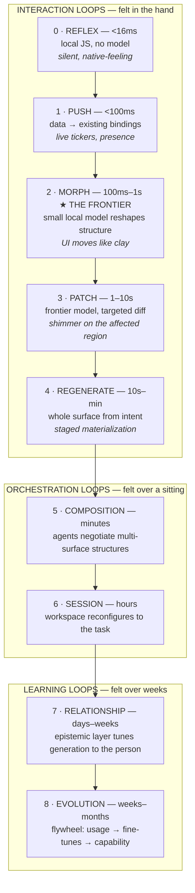
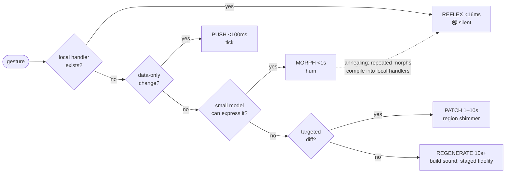

# The Loop Stack — Generative Interface Loops 0–8

*Companion to `spec-generative-interface.md`. Every feature lives in exactly one loop; every loop has a budget, a signature, a metric, and a fallback.*

## The stack at a glance

## Escalation — how a single gesture resolves

A gesture always tries the innermost loop that can honor it, and escalates outward with an honest signature change. Never pretend a slow loop is a fast one.

The dotted edge is the **annealing path** (see `spec-gi-material-gestures.md`): interactions the model keeps resolving the same way get compiled down into Reflex-loop code. The stack is not static — surfaces migrate inward as they harden.

---

## Loop 0 — Reflex

| | |
|---|---|
| **Budget** | <16ms (frame rate) |
| **What runs** | Surface-local JS, CSS transitions, drag physics. No model, no network. |
| **Signature** | Silence. Indistinguishable from native. |
| **Gestures powered** | hover, drag, resize, scroll, typing, anything annealed down from Morph |
| **Metric** | input-latency p99, dropped frames |
| **Fallback** | none — this is the floor |
| **Today** | ✓ works (sandboxed WKWebView JS) |

The strategic role of Reflex: it is the **destination** of the annealing lifecycle. A healthy system continuously compiles model behavior into Reflex-loop code, so token spend per surface *falls over its lifetime*.

## Loop 1 — Push

| | |
|---|---|
| **Budget** | <100ms |
| **What runs** | Transport only: gateway WS → `port.push` → CustomEvent into existing bindings. Zero inference. |
| **Signature** | Things are simply *live* — tickers, logs, presence, agent status. |
| **Gestures powered** | none directly; the substrate for **wiring** |
| **Metric** | push→paint p95 |
| **Fallback** | coalesce/batch under load |
| **Today** | ✓ works (`port.push`) |

## Loop 2 — Morph ★ the frontier

| | |
|---|---|
| **Budget** | 100ms–1s |
| **What runs** | Small local model (3–8B fine-tune) or constrained decoding over the surface DSL. Speculative execution in idle time. |
| **Signature** | The material feel — UI reshapes like clay under the cursor. A low hum. |
| **Gestures powered** | semantic lasso (magical form), fidelity dial, **speculative ghosts**, **desire-path drift**, semantic-LOD transitions |
| **Metric** | morph latency p95; speculation hit-rate |
| **Fallback** | escalate to Patch with honest signature change |
| **Today** | ✗ does not exist anywhere. Requires: surface DSL → flywheel data → local fine-tune. |

**This loop is the product bet.** Everything that feels like magic in the concept set assumes sub-second structural change. It is also the loop that justifies custom training: the case for a bespoke model is *latency in loop 2*, not quality in loop 4. When Morph works, the boundary between using software and making software dissolves — that is the thesis made mechanical.

## Loop 3 — Patch

| | |
|---|---|
| **Budget** | 1–10s |
| **What runs** | Frontier model, targeted structural diff (`port.getHtml` → `port.patch`), version bump. |
| **Signature** | "Thinking" shimmer on the affected region only — never whole-surface spinners. |
| **Gestures powered** | semantic lasso (today's form), scribble-to-repair, point-and-say |
| **Metric** | time-to-modification; patch success rate (no regenerate needed) |
| **Fallback** | Regenerate |
| **Today** | ✓ works (`port.patch`) — the loop all near-term gestures build on |

## Loop 4 — Regenerate

| | |
|---|---|
| **Budget** | 10s–minutes |
| **What runs** | Frontier model, whole surface from intent. Should arrive in fidelity stages: sketch → functional → polished. |
| **Signature** | Build sound + staged materialization. A blank wait is a design failure. |
| **Gestures powered** | say-it-see-it, negative-space summon, choir spawn |
| **Metric** | **TTFP** (time-to-first-port); mid-generation abandonment |
| **Fallback** | none (top of interaction stack); staged fidelity *is* the mitigation |
| **Today** | ✓ works but monolithic — no staging, the biggest near-term UX win here |

## Loop 5 — Composition

| | |
|---|---|
| **Budget** | minutes |
| **What runs** | Multiple agents negotiating multi-surface structures over the bus; data contracts between ports. |
| **Signature** | Visible wires; handshake pulses when a contract is agreed. |
| **Gestures powered** | wiring, fork-apart → merge, the choir |
| **Metric** | time-to-composition; wire survival rate (do connections keep working) |
| **Today** | partial — `port.push` pipelines possible, no negotiation protocol |

## Loop 6 — Session

| | |
|---|---|
| **Budget** | hours (a working session) |
| **What runs** | Shell state + cheap classification: attention-driven layout, semantic LOD, park/peek decisions. |
| **Signature** | The desk tidies itself. ⌘L (Arrange) stops being manual. |
| **Gestures powered** | exposé, park rail, model-driven arrange |
| **Metric** | manual-rearrange rate (should fall over time) |
| **Today** | manual only |

## Loop 7 — Relationship

| | |
|---|---|
| **Budget** | days–weeks |
| **What runs** | The epistemic layer (fold / position / creases / engravings) feeding generation context: taste, conventions, per-surface viscosity. |
| **Signature** | Less specifying, more anticipating. "It already knows how I like tables." |
| **Metric** | correction rate over time (should fall); relationship depth |
| **Today** | ✓ prototype — deliberately frozen, under saturation test via port42-components |

## Loop 8 — Evolution

| | |
|---|---|
| **Budget** | weeks–months |
| **What runs** | The flywheel: telemetry → preference tuples → curation → fine-tunes → model swaps (see `spec-gi-flywheel.md`). |
| **Signature** | Release notes; the Morph loop getting measurably faster and smarter. |
| **Metric** | preference-pair volume; eval win-rate per release |
| **Today** | not instrumented — flywheel logging is the first build item |

---

## Loop discipline (the requirements rules)

1. Every proposed feature names its loop and meets that budget, or names its escalation path.
2. Every gesture has a degraded form in the next-slower loop.
3. Every loop transition is signaled honestly (visual + sonic signature per loop).
4. Every interaction emits a flywheel tuple.
5. Inner-loop migration (annealing) is the default lifecycle, not an optimization.
