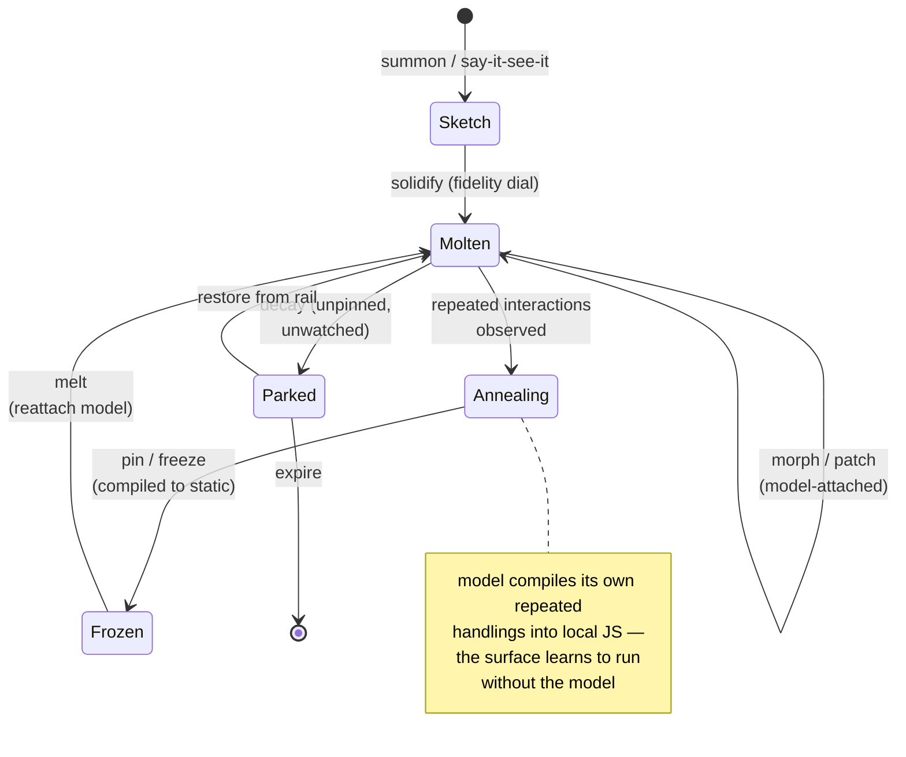

# Material Physics & the Gesture Grammar

*Companion to `spec-generative-interface.md`. The physical model for generated surfaces, the gestures that manipulate them, and the wilder concepts.*

## Material physics

Generated surfaces are a material with properties that map one-to-one onto real engineering costs. The user manipulates physics; the system manages tokens.

| Property | UX meaning | Engineering meaning |
|----------|-----------|---------------------|
| **Temperature** | molten ↔ frozen | model-attached (costs tokens, can reshape) ↔ compiled static (free, fast, fixed) |
| **Viscosity** | how readily it morphs | how aggressively speculative reshaping is allowed; set per-surface by the Relationship loop |
| **Weight** | how established it feels | pinned/persistent vs. decaying; storage + attention priority |
| **Fidelity** | sketch ↔ polished | generation staging; how much model effort has been spent |

### The surface lifecycle



### Annealing — the self-compiling UI

The defining mechanic. A surface starts as pure model improvisation (every interaction escalates to Patch). The model observes its own repeated resolutions — "every time they click a row, I show the detail panel" — and **emits that behavior as local JS**, migrating it from loop 3 down to loop 0. Consequences:

- Token cost per surface **falls over its lifetime** instead of accumulating.
- Frequently-used surfaces converge on app-like reliability; novel interactions still escalate.
- "Freeze" is just annealing forced to completion; "melt" reverses it.
- The flywheel logs which behaviors annealed — that's training data for better initial generations.

## The gesture grammar

| Gesture | Loop | Protocol mapping | Status |
|---------|------|------------------|--------|
| **Semantic lasso** — circle a region + say the change | 3 (→2 later) | region → `port.patch` with spatial context | buildable now |
| **Point-and-say (deixis)** — "make THIS bigger" | 3 (→2) | cursor pos + utterance resolved together | buildable now |
| **Version scrub** — timeline on every surface | 1 | `port.history` + `port.restore` | data already exists |
| **Scribble-to-repair** — scratch out = fix it | 3 | strike region → `port.patch("wrong")` | buildable now |
| **Freeze / melt** — pin compiles, melt reattaches | 0/3 | snapshot to static ↔ re-bind model | mostly plumbing |
| **Fork-apart** — pull a tile into two variants | 4 | parallel generations, choice logged | buildable now |
| **Wiring** — drag a line between ports | 5 | agents negotiate `port.push` contract | needs negotiation protocol |
| **Solidify / fidelity dial** — push sketch toward polish | 4 staged | staged regeneration | needs staging |
| **Negative-space summon** — drag empty desktop; drag size = ambition budget | 4 | rect → `port.create` with size/fidelity hint | buildable now |
| **The knock** — agent requests attention, human grants | 6 | attention API + aura signature | needs attention model |

## The input layer — how intent enters (the "say it" half)

The gestures above are one input channel (spatial manipulation). But "say it, see it" has two halves and the gestures only cover the output side. Intent is **multimodal and fused**: a single instruction routinely combines pointing, speech, and media, resolved into one loop call. This is arguably the more novel half — everyone demos text→UI; almost no one fuses point + voice + webcam → UI.

| Channel | Modalities | Resolves to | Device path (bridges that exist) |
|---------|-----------|-------------|----------------------------------|
| **Language** | typed text, dictation, ambient voice | intent string | `audio.capture` (mic) |
| **Deixis** | cursor, pointing, region select, gaze (later) | *the referent* — the "THIS" | Shell tile + DOM coords |
| **Manipulation** | the gesture grammar above | direct structural edit | port events |
| **Media-in** | image/file drop, screenshot, screen-share, clipboard | reference content | `fs.pick`, `clipboard.read`, `screen.capture`, file-drop |
| **Sensor** | webcam, ambient mic, location, device motion | live context | `camera.capture`, `audio.capture`, `screen.stream` |
| **Ambient context** | on-screen surfaces, relationship state, time | implicit priors | epistemic layer + surface registry |

**Fusion is the mechanic.** "Make this like that photo" = deixis (this) + language (make like) + media (that photo), fused into one Patch call with three attachments. The requirement: every loop call accepts a **multimodal intent bundle**, not a text prompt. Concretely:

```
intent_bundle {
  utterance:   text | transcribed voice,
  referent:    surface region / element / null   (deixis),
  attachments: [image | file | screen-capture | webcam-frame],
  context:     active surfaces + relationship priors
}
```

Notes:
- **Most of the capture already exists.** The device bridges enumerated in the review (`camera.capture`, `audio.capture/speak`, `clipboard.read/write`, `screen.capture/stream`, `fs.pick`, file-drop into `PortView`) are the input substrate — they were built as *companion output* tools but they're equally *user input* channels. Re-framing them is mostly wiring, not new capability.
- **Voice is the biggest unbuilt lever** for say-it-see-it: ambient dictation → intent, no typing. Mic capture exists; the missing piece is a persistent listen loop + push-to-talk gesture.
- **Webcam as input** (not just capture) is genuinely novel: "build me a UI that reacts to my expression," "use what you see on my desk." Loop 1/2 territory.
- Every input channel must declare which **loop** it drives and emit a **flywheel tuple** (which modality produced which accepted surface — training signal for fusion).

## Wilder concepts

**Speculative UI (ghost tiles).** Idle Morph-loop capacity renders what you might want next as translucent tiles in the peek rail. Glance and grab → solidifies (positive tuple). Ignored → decays (negative tuple). Branch prediction for interfaces: wrong ghosts cost idle compute, right ones feel like telepathy.

**Semantic LOD.** Surfaces render at information densities keyed to attention distance, like game-engine level-of-detail: focused tile = full UI; desktop tile = summary; parked = a glyph/aura of live state; galaxy view = one pixel of meaning. Same surface, projections chosen by attention. (Loop 6.)

**The choir.** For a big intent, several companions render candidate surfaces simultaneously; the desktop briefly becomes a marketplace of proposals; the human picks; losers decay. Every choir round emits clean pairwise preference data. (Loop 5.)

**Desire paths.** Gestures leave residue. Controls you use grow and migrate toward your hand; flows you repeat compress into one-touch macros the companion proposes. The interface erodes toward its user. (Loops 2 + 7.)

**The interface dreams.** Space heartbeats spend idle time drafting reorganizations, syntheses, and cleanups; proposals park in a **dreams rail** for morning review. The heartbeat feature was always for this. (Loop 6.)

**Loop sonification.** Each loop has an audio signature — Reflex silent, Push ticks, Morph hums, Patch shimmers, Regenerate builds. Latency honesty through sound instead of spinners. (Cross-cutting.)

**Multiplayer material.** Two humans + companions molding the same surface, cursors carrying auras, gestures visible to each other. A space is a shared workbench, not a chat log with attachments. (Loop 5, rides existing sync.)

**Multi-host projection.** The surface DSL projects beyond WKWebView: TUI hosts (terminal ports), and later watch/AR. One generative surface, many renderers — the protocol play again.

## Ship order

1. **Flywheel logging** (see `spec-gi-flywheel.md`) — under everything, first.
2. **Semantic lasso + version scrub + freeze/melt** — all live on today's Patch loop; they prove the material feel and start the preference stream.
3. **Staged regeneration** (sketch → functional → polished) — biggest UX win on the existing Regenerate loop.
4. **Surface DSL** — prerequisite for Morph.
5. **Speculative ghosts + Morph loop** — the frontier.
